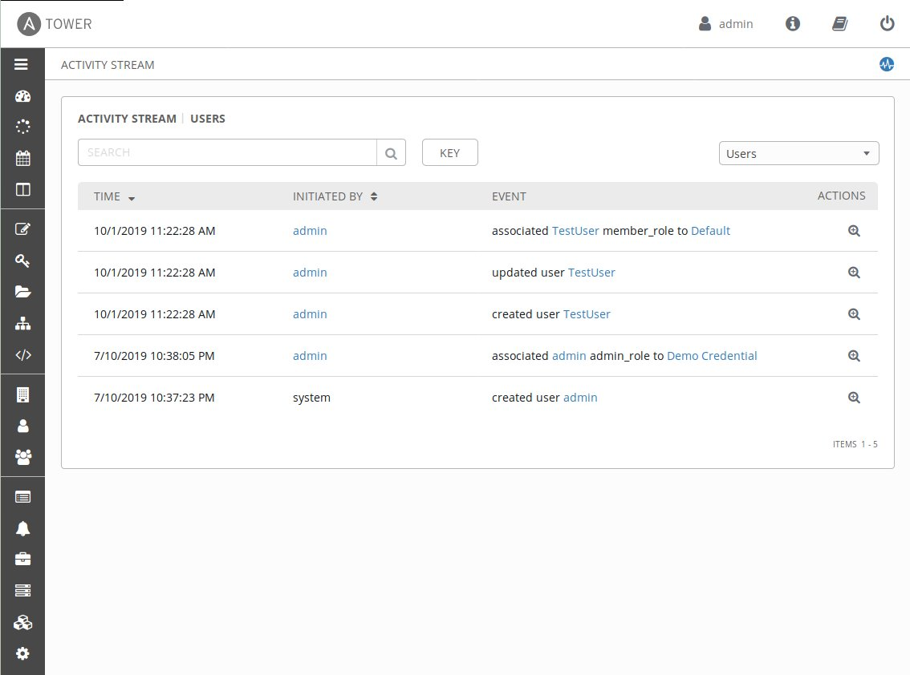
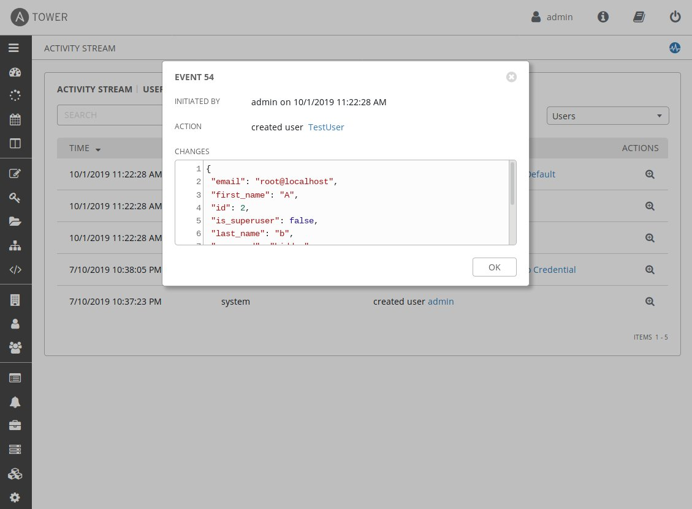
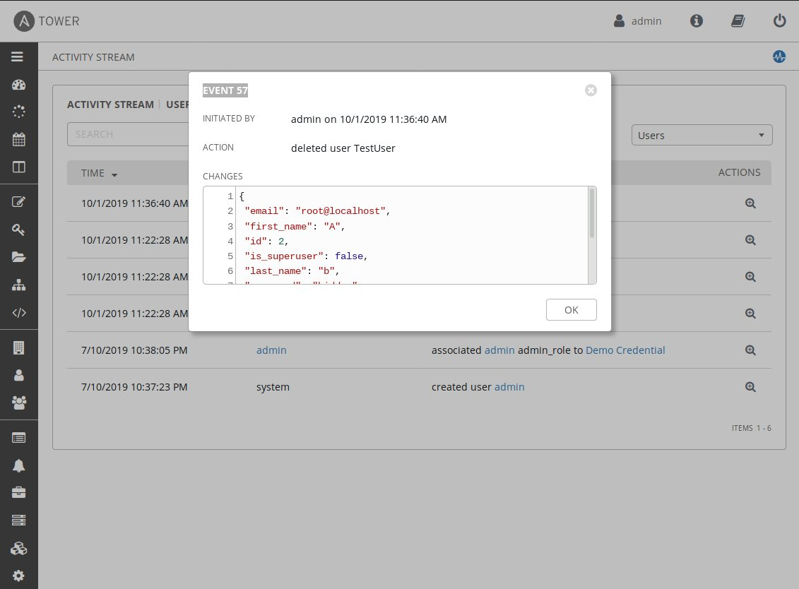
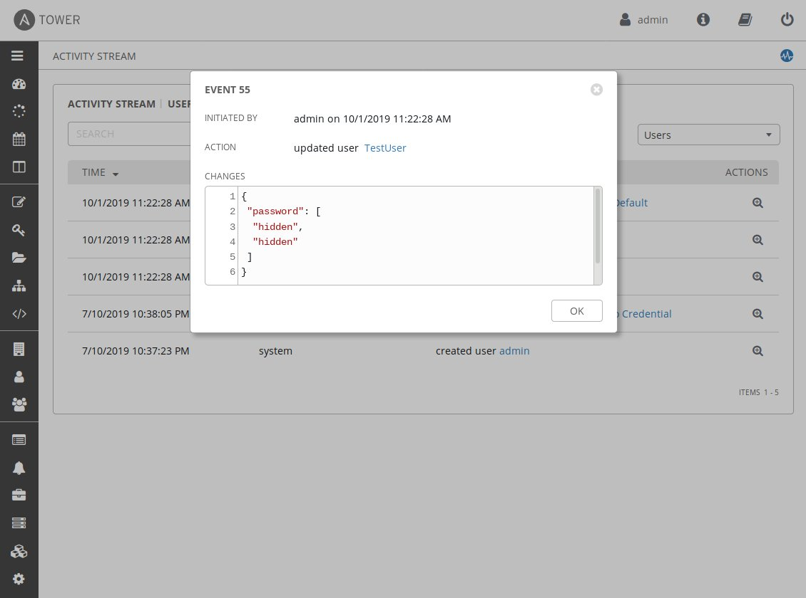

# Auditable Events or Activities

Following is a list of events and activities as defined by Appendix B of [Intelligence Community Standard 500-27 - Collection and Sharing of Audit Data](https://www.dni.gov/files/documents/FOIA/DF-2016-00213.pdf) and example of audit trail generated by Red Hat Ansible Tower.

## Authentication Events - Logons - Success

```
Sep 25 15:46:09 mnau dockerd-current[10023]: 2019-09-25 13:46:09,571 INFO     awx.api.generics User admin logged in.
```

## Authentication Events - Logons - Failure

```
Sep 25 15:44:58 mnau dockerd-current[10023]: 2019-09-25 13:44:58,065 WARNING  awx.api.generics Login failed for user admin from 172.18.0.1
```

## Authentication Events - Logoffs - Success

```
Sep 25 15:58:51 mnau dockerd-current[10023]: 2019-09-25 13:58:51,050 INFO     awx.api.generics User admin logged out.
```

## User & Group Management events - User add

All changes to Users are logged and available for auditing. At the users page, you can click `View Activity Stream` icon at top right corner of the view to see changes relevant to the User data.



Each log event contains details that can be reviewed.



## User & Group Management events - User delete

User deletion action is logged with all the properties of user model at the time of deletion.



## User & Group Management events - User modify

User modifications are logged while sensitive information (like passwords) will be hidden from the audit log.



## User & Group Management events - User suspend

N/A - User suspend action not available.

## User & Group Management events - User lock

N/A - User lock action not available.

## :construction: User & Group Management events - Group add

```
Sep 27 12:28:05 mnau dockerd-current[13822]: 2019-09-27 10:28:05,752 INFO     awx.api.generics Team None{'name': 'TestTeam', 'description': 'Must be agile!', 'organization': <Organization: Default-1>} created by admin.
```

## :construction: User & Group Management events - Group delete

```
Sep 27 12:36:17 mnau dockerd-current[13822]: 2019-09-27 10:36:17,051 INFO     awx.api.generics Team TestTeam-None deleted by admin.
```

## :construction: User & Group Management events - Group modify

```
Sep 27 12:35:51 mnau dockerd-current[13822]: 2019-09-27 10:35:51,948 INFO     awx.api.generics Team modified by admin. Values are {'name': 'TestTeam', 'description': "Let's deliver quick!", 'organization': <Organization: Default-1>}
```

## Privilege/Role escalation

N/A - privilege/role escalation action not available.

# Assessment Details
Assessment was conducted during autumn of 2019. Both Web Interface and API was assessed. Relevant versions: AWX-7.0.0-228-g640e5391f, Ansible 2.10.0.dev0.
